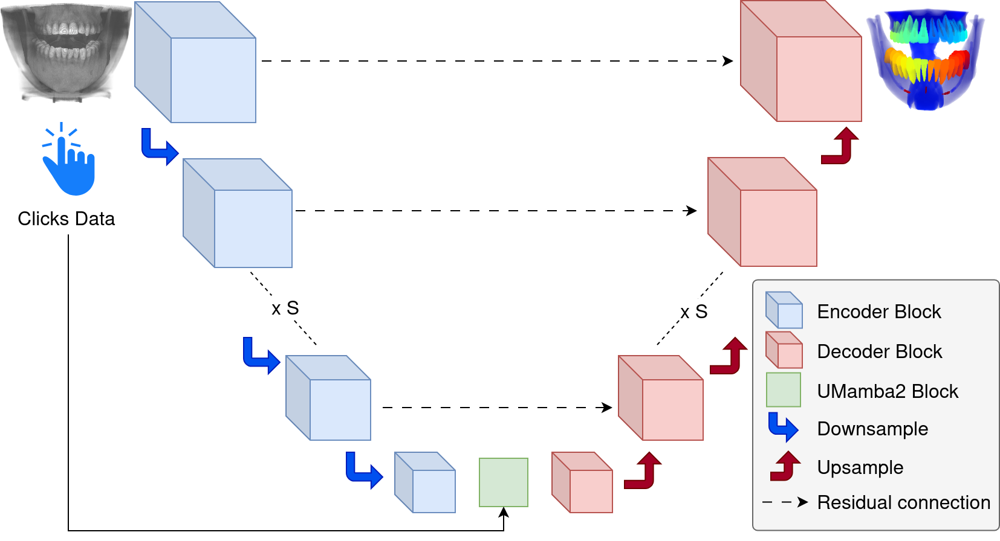
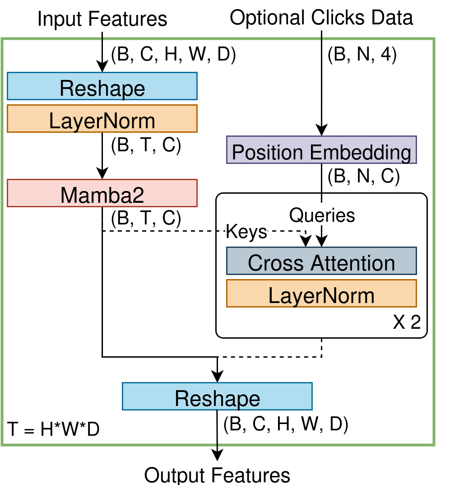

# U-Mamba2
UMamba2 [](https://arxiv.org/abs/2509.12069)
| UMamba2-SSL [](https://arxiv.org/abs/2509.20154)
### First Place Solution of team KCL TAIR Lab for the [ODIN](https://odin-workshops.org/) Challenges ([ToothFairy3](https://toothfairy3.grand-challenge.org/) and [STSR 2025](https://www.codabench.org/competitions/6468/))
Leaderboard: [Task 1](https://toothfairy3.grand-challenge.org/evaluation/test-phase/leaderboard/) and [Task 2](https://toothfairy3.grand-challenge.org/evaluation/iac-interactive-segmentation-test-phase/leaderboard/) in ToothFairy 3; [Task 1](https://www.codabench.org/competitions/6468/#/results-tab) in STSR 2025.

## Description
<div style="justify-content:center">
  
  &nbsp;&nbsp;&nbsp;&nbsp;
   
</div>

We propose U-Mamba2 which combines the features of U-Net and Mamba2 to efficiently capture global information, in the scope of the ODIN challenges. 
U-Mamba2 has a similar structure to U-Net, with a symmetric encoder-decoder architecture to extract image features across multiple scales, 
with residual connections between the encoder and decoder blocks at each stage to help the model combine low-level features with high-level features. 
As convolutional operations are inherently localized, a vanilla U-Net has limited capability to model global long-range dependencies in images. 
Hence, we leverage Mamba2 to enhance the model's ability to model global long-range dependencies by treating the features as long sequences. 
Similar to Mamba, Mamba2 scales linearly with sequence length, but is based on the SSD framework that restricts the internal recurrent structure 
and uses matrix multiplication instead of selective scan, leading to a significant speedup through parallelism.
We introduce an optional interactive branch to allow the model to be prompted with user-provided clicks to further guide and 
refine the output of U-Mamba2, enhancing accuracy and enabling human-in-the-loop collaboration. The optional branch consists of
a SAM-style point encoder and cross attention blocks to allow the model to integrate click information with the image features.

### Incorporating Dental Knowledge
We incorporate several domain knowledge into the model design to address key challenges of dental anatomy segmentation in CBCT, in the scope of the ToothFairy3 challenge.
This includes label smoothing of related anatomies, weighted loss for tiny structures, left-right mirroring augmentation and post-processing based on structure volume.

### Semi-supervised Learning
Building on the powerful U-Mamba2 model, we introduce U-Mamba2-SSL, a semi-supervised learning framework that employs a multi-stage training strategy. 
The framework first pre-trains U-Mamba2 in a self-supervised manner using a disruptive autoencoder. 
It then leverages unlabeled data through consistency regularization, where we introduce input and feature perturbations to ensure stable model outputs. 
Finally, a pseudo-labeling strategy is implemented with a reduced loss weighting to minimize the impact of potential errors.

## Setup Environment
The codes have been tested on Ubuntu 22.04 and 24.04, Python 3.11, Pytorch 2.5.1 Cuda 12.4 and 2.7.1 Cuda 12.8, 
but they should work on major Python 3 versions and most Pytorch 2 versions.
1. Install [PyTorch](https://pytorch.org/get-started/locally/) as described on their website (conda/pip). Please 
install the latest version with support for your hardware (cuda, mps, cpu).
2. Install the library with
   ```
   pip install -e .
   ```
3. Follow the instructions [here](documentation/setting_up_paths.md) to set environment variables for nnUNet.
4. Install `mamba-ssm` library with
   ```bash
   pip install causal-conv1d==1.5.2 mamba-ssm==2.2.5 --no-build-isolation
   ```
5. Download [pretrained model weights](https://drive.google.com/drive/folders/1xhUkHCpo_50sNWvGH9CrN8Ws0hSjoa_k?usp=sharing)
(optional) and place it in the `pretrained_weights` directory.

## How to run
- To train your own model, please see the usage instruction [here](documentation/how_to_use_nnunet.md) or refer to the
original [nnUNet](https://github.com/MIC-DKFZ/nnUNet) repo. The main thing is to update your nnUNet plan file to use U-Mamba2
by setting `architecture.network_class_name = "nnunetv2.nets.UMambaBot2"`. See our challenge `readme.md` files below for examples.
- To reproduce our challenges' works, please see the readme files for the [Toothfairy3](documentation/competitions/Toothfairy3) and
[STSR25](documentation/competitions/STSR25) challenges in the documentation folder.

## Citation
If you find this work useful for your research, please cite our work as
```bibtex
@inproceedings{u-mamba2,
   title={U-Mamba2: Scaling State Space Models for Dental Anatomy Segmentation in CBCT}, 
   author={Zhi Qin Tan and Xiatian Zhu and Owen Addison and Yunpeng Li},
   year={2025},
   booktitle={Medical Image Computing and Computer Assisted Intervention (MICCAI)},
   maintitle={Workshop on Oral and Dental Image Analysis (ODIN)},
}

@inproceedings{u-mamba2-ssl,
   title={U-Mamba2-SSL for Semi-Supervised Tooth and Pulp Segmentation in CBCT}, 
   author={Zhi Qin Tan and Xiatian Zhu and Owen Addison and Yunpeng Li},
   year={2025},
   booktitle={Medical Image Computing and Computer Assisted Intervention (MICCAI)},
   maintitle={Workshop on Oral and Dental Image Analysis (ODIN)},
}
```

## Feedback
Suggestions and opinions on this work (both positive and negative) are greatly welcomed. 
Please contact the authors by sending an email to `zhiqin1998 at hotmail.com`.

## Acknowledgements
We acknowledge all the authors of the employed public datasets for releasing their work for research purposes.
We thank the authors of  [mamba](https://github.com/state-spaces/mamba),
[nnUNet](https://github.com/MIC-DKFZ/nnUNet) and 
[DAE](https://github.com/Project-MONAI/research-contributions/tree/main/DAE) for releasing their source code.

## Disclaimer
This is a forked repo of [nnUNet v2.6.2](https://github.com/MIC-DKFZ/nnUNet/tree/74ceb6803d10dcee29b2cc481678d3a3d069f281). We made a few changes to the core training codes
for the competition (e.g. reduce precision for evaluation, extra logging, including interactive clicks, etc.).
Please see [this](https://github.com/zhiqin1998/UMamba2/commit/8cb395407757ae2130657751e96f32a781031caf) commit
for our contributions. The original code is licensed under Apache 2.0 but our contributions are licensed under CC BY-NC.

If you prefer to use the original repo, simply copy the [`nets`](nnunetv2/nets) folder to 
[nnUNet/nnunetv2](https://github.com/MIC-DKFZ/nnUNet/tree/master/nnunetv2) and make sure to update the generated plan files with
`architecture.network_class_name = "nnunetv2.nets.UMambaBot2"`.

In the rare case that you encounter nan during training, try disabling mixed precision in [`nnunetv2/nets/UMambaBot_3d.py`](nnunetv2/nets/UMambaBot_3d.py)
by uncommenting `@autocast('cuda', enabled=False)`.
